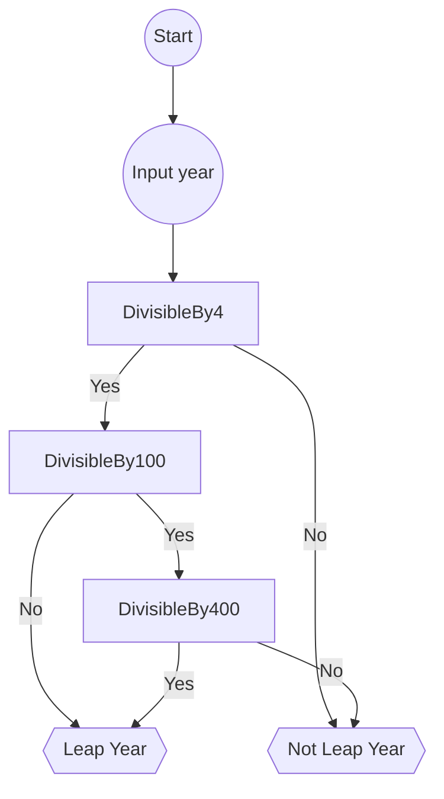

## flowchart



## Pseudocode

```text
1. Input year
2. If (year is divisible by 4) then
3.     If (year is divisible by 100) then
4.         If (year is divisible by 400) then
5.             Print "Leap Year"
6.         Else
7.             Print "Not Leap Year"
8.     Else
9.         Print "Leap Year"
10. Else
11.    Print "Not Leap Year"

```