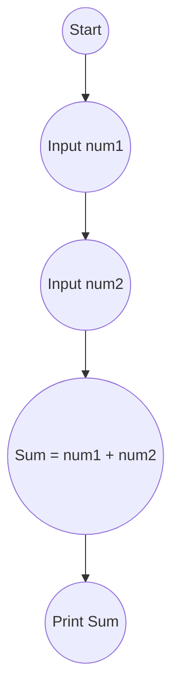

## flowchart


```mermaid
graph TD
;
    Start((Start)) --> Input1((Input num1));
    Input1 --> Input2((Input num2));
    Input2 --> Sum((Sum = num1 + num2));
    Sum --> Print((Print Sum));

```

## Pseudocode

```text
1. Input num1
2. Input num2
3. Sum = num1 + num2
4. Print Sum
```