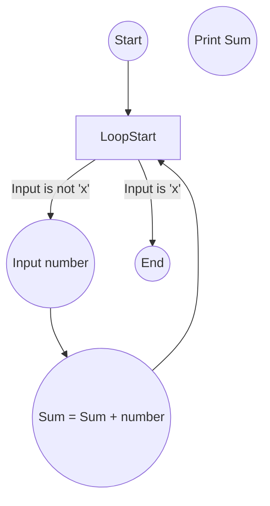

## flowchart



## Pseudocode

```text
1. Sum = 0
2. Repeat
3.     Input number
4.     If number is 'x' then
5.         Exit loop
6.     Else
7.         Sum = Sum + number
8. Until input is 'x'
9. Print Sum

```