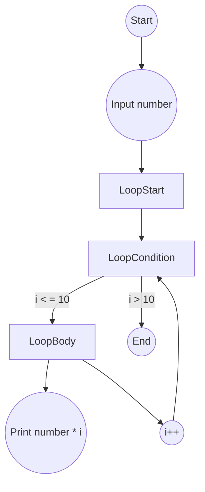

## flowchart


```mermaid
graph TD
;
    Start((Start)) --> Input((Input number));
    Input --> LoopStart;
    LoopStart --> LoopCondition;
    LoopCondition -->|i < = 10| LoopBody;
    LoopCondition -->|i > 10| LoopEnd;
    LoopBody --> Multiply((Print number * i));
    LoopBody --> Increment((i++));
    Increment --> LoopCondition;
    LoopEnd((End));

```

## Pseudocode

```text
1. Input number
2. For i = 1 to 10
3.     Print number * i
4. End For
```