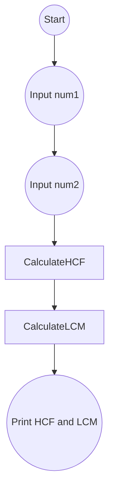

## flowchart


```mermaid
graph TD;
    Start((Start)) --> Input1((Input num1));
    Input1 --> Input2((Input num2));
    Input2 --> CalculateHCF;
    CalculateHCF --> CalculateLCM;
    CalculateLCM --> Print((Print HCF and LCM));
```

## Pseudocode

```text
1. Input num1
2. Input num2
3. Calculate HCF of num1 and num2
4. Calculate LCM of num1 and num2
5. Print HCF and LCM
```